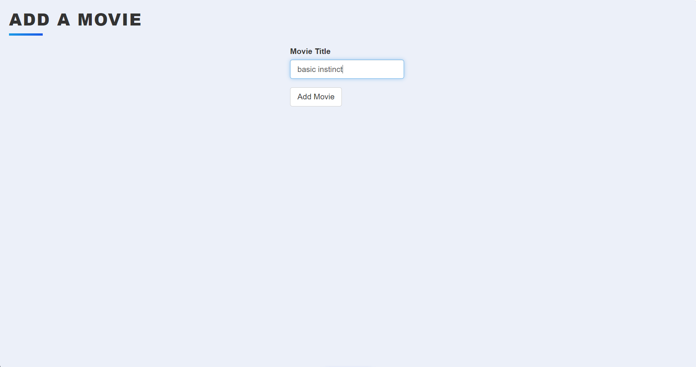
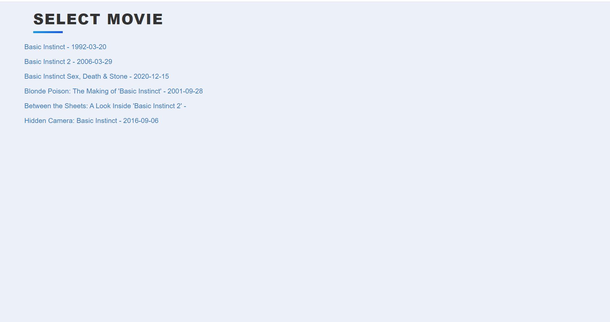
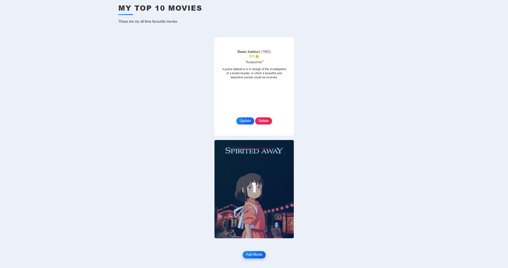

# Flask_Your_Top10_Movie_List

Flask app: Make your own top 10 fav movies list!

## Using the Movies DB API, you can create your own top 10 movies list that is
## customizable and updatable!

Try the working website here: https://mytop-ten-movies.herokuapp.com/ 

